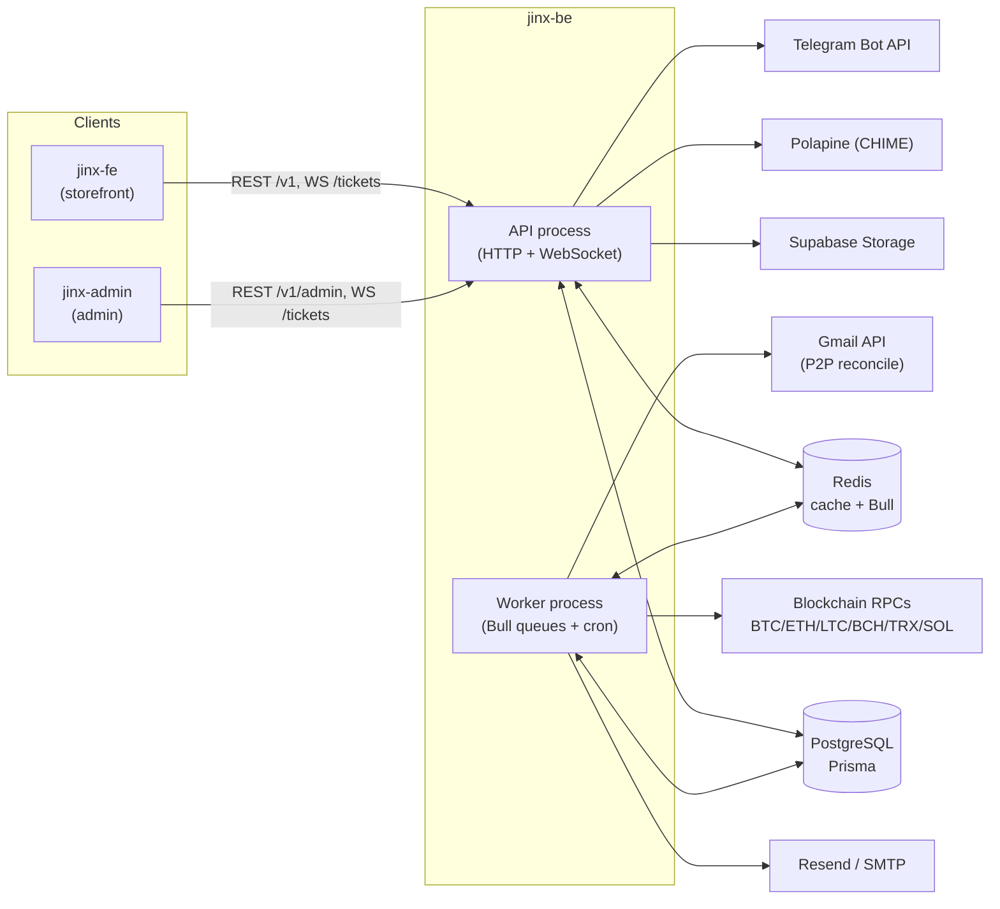
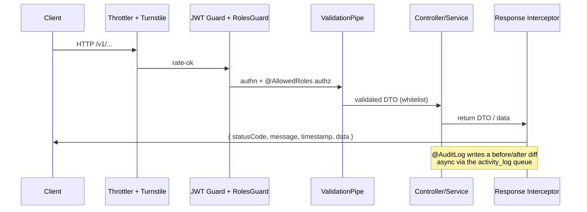
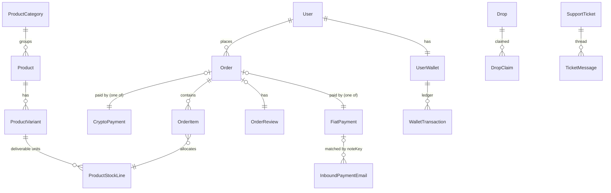
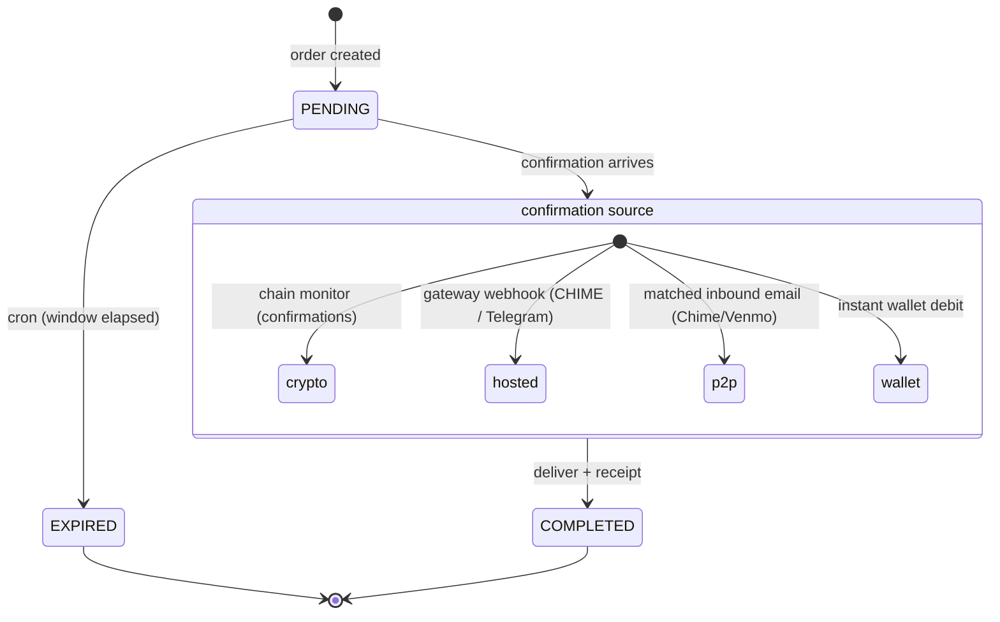

# Jinx.to Backend — Architecture Guide

> Developer deep-dive for `jinx-be`, the NestJS backend that powers the Jinx.to digital-goods platform.
> Companion docs live in the sibling repos: `jinx-fe/ARCHITECTURE.md` (storefront) and `jinx-admin/ARCHITECTURE.md` (admin dashboard).

---

## 1. System Context

Jinx.to is a digital-goods store (accounts, gift cards, instant-delivery digital products) made of **three deployable apps over one backend**:

| App | Repo | Role |
| --- | --- | --- |
| Storefront | `jinx-fe` | Customer-facing shop, cart, checkout, wallet, drops, support |
| Admin dashboard | `jinx-admin` | Operator back office: catalog, orders, users, settings, reconciliation |
| **Backend (this repo)** | `jinx-be` | REST API + WebSocket + background workers; the single source of truth |



The API and the Worker run **the same codebase** in two modes (see §2). Postgres is the system of record; Redis backs caching and the Bull job queues that connect the API to the Worker.

---

## 2. Tech Stack & Runtime

| Concern | Choice |
| --- | --- |
| Framework | **NestJS 11** |
| Language / build | TypeScript 5.9, compiled with **SWC** (`.swcrc`, `nest-cli.json`) |
| Runtime | **Node ≥ 20**, Yarn 1.x |
| ORM / DB | **Prisma 6** + **PostgreSQL** (`prisma/schema.prisma`) |
| Cache / queues | **Redis** (`cache-manager-ioredis`) + **Bull** (`@nestjs/bull`); Bull Board UI at `/admin/queues` |
| Auth | **JWT** access/refresh (`@nestjs/jwt`, `passport-jwt`), **argon2** hashing, **speakeasy** TOTP 2FA |
| Email | **Resend** (primary) + Nodemailer/SMTP, Handlebars templates |
| Storage | **Supabase Storage** (S3-style) + **sharp** image watermarking |
| Realtime | **Socket.IO** (`@nestjs/platform-socket.io`) |
| Crypto | `bitcoinjs-lib`, `ethers`, `@solana/web3.js`, Tron helpers, `@scure/bip32`/`bip39` (HD wallets) |
| i18n | `nestjs-i18n` (English, `src/languages/en/`) |
| Observability | **Pino** (`nestjs-pino`) + **Sentry** |
| API docs | **Swagger** (non-production only, `src/swagger.ts`) |
| Security | helmet, compression, `@nestjs/throttler`, Cloudflare Turnstile |

### Dual runtime role (one codebase, two processes)

`src/main.ts` reads `APP_ROLE` (default `api`) and boots one of two root modules:

- **`api`** → `bootstrapApi()` → `AppModule` (`src/app/app.module.ts`): HTTP + WebSocket server, Bull Board, Swagger, global pipes/interceptors.
- **`worker`** → `bootstrapWorker()` → `WorkerAppModule` (`src/app/worker.module.ts`): headless Bull processors + cron schedulers, **no HTTP**.

Deploy them as **two containers** sharing the same DB and Redis. The API enqueues jobs; the Worker consumes them.

Global setup in `bootstrapApi()`: URI versioning (`/v1`), global `ValidationPipe` (`whitelist` + `forbidNonWhitelisted`), raw-body capture (for webhook HMAC verification), CORS, graceful shutdown hooks.

---

## 3. Project Layout

```
src/
  main.ts                # APP_ROLE switch: bootstrapApi() | bootstrapWorker()
  app/                   # Root modules (app.module, worker.module), health, enums, CLI
  common/                # Cross-cutting framework code (see below)
    auth/                # AuthService, JWT strategies, 2FA, OTP, invitations
    request/             # Guards, decorators (@AllowedRoles, @PublicRoute, @CurrentUser), role constants, middleware
    response/            # Response-envelope interceptor + exception filter
    config/              # Typed env config registrations (+ env validation)
    database/            # Prisma DatabaseService
    storage/             # Supabase storage + watermark
    email/               # Resend/SMTP, templates, email builders
    message/             # i18n message translation
  modules/               # Feature modules (see §5)
  languages/en/          # i18n message catalogs
prisma/schema.prisma     # Canonical data model (heavily commented)
documents/               # Existing crypto/payment design docs (phase planning)
```

---

## 4. Request Lifecycle & Cross-Cutting Concerns



- **Response envelope** — `common/response/interceptors/response.interceptor.ts` wraps **every** success reply as `{ statusCode, message, timestamp, data }`. It runs `class-transformer` serialization (driven by response/pagination doc decorators), normalizes Prisma `Decimal` → string, and translates `message` via i18n. Errors are shaped by `common/response/filters/`. *(The clients unwrap `res.data.data` — see the FE/admin docs.)*
- **Validation** — global `ValidationPipe` with `whitelist` + `forbidNonWhitelisted`; every input is a `class-validator` DTO under each module's `dtos/request/`.
- **i18n** — `nestjs-i18n`, catalogs in `src/languages/en/*.json`. Controllers return message **keys**; the interceptor translates them.
- **Config** — `@nestjs/config` global with fail-fast env validation (`common/config/env.validation.ts`); registrations aggregated in `common/config/index.ts` (app, redis, auth, storage, crypto, email, **payment-gateway**, turnstile, …).
- **Audit log** — `activity-log/interceptors/audit-log.interceptor.ts` + the `@AuditLog` decorator capture a JSON before/after diff of admin mutations and write them asynchronously via the `activity_log` Bull queue.
- **Rate limiting / hardening** — `@nestjs/throttler`, helmet, compression, Cloudflare Turnstile (`common/request/guards/turnstile.guard.ts`); request-id middleware in `common/request/middlewares/`.

---

## 5. Module Inventory (`src/modules/`)

| Module | Purpose |
| --- | --- |
| `user` | Customer + team/staff accounts; signup, profile, ban/flag, team invitations (`user.public` / `user.admin` / `user.team` controllers) |
| `product` | Catalog: products, variants, images, categories, flags (hot/new/restocked), warranty |
| `stock-line` | Per-variant inventory units (the actual deliverable codes/secrets); reserve → sell lifecycle, bulk add, stale-reservation sweeper |
| `cart` | Shopping cart + line items per user |
| `coupon` | Discount codes (percent/fixed), category scoping, usage limits/expiry |
| `order` | Order lifecycle, delivery, PDF receipts, refunds, replacements, store credit |
| `crypto-payment` | On-chain payments (BTC/ETH/LTC/BCH/SOL/USDT/USDC); HD address gen, monitoring, confirmations, forwarding, exchange rates |
| `fiat-payment` | Hosted + P2P fiat: CHIME (Polapine), Telegram Stars, Manual P2P (Chime/Venmo); gateway factory + webhooks |
| `email-reconciliation` | Polls Gmail for Chime/Venmo "you got paid" emails, parses, matches to Manual-P2P payments |
| `wallet` | Internal USD store-credit wallet; balances, transactions, crypto top-ups, admin adjustments |
| `drop` | Limited "drops" of stock to allowed users; claims and claim-vouches |
| `vouch` | User-submitted proof/testimonial images tied to order items; admin approval |
| `ticket` | Support tickets + threaded messages/attachments; real-time via `ticket.gateway.ts` (WebSocket) |
| `review` | Per-order ratings/comments |
| `activity-log` | Audit trail; interceptor + decorators auto-capture admin actions, written async |
| `settings` | Store-wide config (general, social, payment, buyer-protection, landing, maintenance); Owner-gated |
| `dashboard` | Sales/customer/revenue metrics + reports |
| `legal` | CMS legal pages (terms/privacy/refund/cookie) |
| `faq` | FAQ categories and items |
| `file` | File/image upload endpoints (to Supabase) |

Plus `src/app/controllers/health.controller.ts` and seed CLI commands (`src/cli.ts`, `seed:*` scripts).

---

## 6. Data Model (`prisma/schema.prisma`)

The schema is heavily commented and is the canonical reference. Grouped overview:

- **Identity & access** — `User` (see the email-uniqueness note below), `Role` enum.
- **Catalog & inventory** — `ProductCategory → Product → ProductVariant → ProductStockLine`, `ProductImage`; `Coupon ↔ CouponCategory`.
- **Commerce** — `Cart → CartItem`; `Order → OrderItem`; `OrderReview`, `Vouch`.
- **Payments** — `CryptoPayment`, `FiatPayment`, `InboundPaymentEmail`, `SystemWalletIndex`, `CryptoExchangeRate`.
- **Wallet** — `UserWallet → WalletTransaction`, `WalletTopUp`.
- **Support / CMS / ops** — `SupportTicket → TicketMessage → TicketAttachment`; `CmsContent`, `FaqCategory/FaqItem`, `SystemSettings`; `Analytics`, `ActivityLog`.



**Key enums** (verified in schema):

- `Role`: `USER, SUPER_ADMIN, OWNER, MOD, ALLIANCE, SUPPORT`
- `OrderStatus`: `PENDING, COMPLETED, CANCELLED, REFUNDED`
- `PaymentGateway`: `CHIME, TELEGRAM_STARS, MANUAL_P2P`
- `P2PProvider`: `CHIME, VENMO`
- `CryptoCurrency`: `BTC, ETH, LTC, BCH, USDT_ERC20, USDT_TRC20, USDC_ERC20, SOL`
- `PaymentStatus` (crypto): `PENDING, PAID, CONFIRMING, CONFIRMED, FORWARDING, FORWARDED, FORWARDING_FAILED, EXPIRED, FAILED`
- `FiatPaymentStatus`: `PENDING, PROCESSING, PAID, FAILED, EXPIRED, CANCELLED, REFUNDED`
- `StockLineStatus`: `AVAILABLE, RESERVED, SOLD, REFUNDED`
- `InboundPaymentStatus`: `UNMATCHED, MATCHED, IGNORED`

> **Email is not globally unique by design.** One email may hold **one customer (`USER`) account and one team (staff) account**. Prisma can't express this, so it is enforced by **two partial unique indexes** (live-CUSTOMER, live-TEAM) defined in the SQL migrations, not in `schema.prisma`. Consequently, never look a user up by email alone — always scope by portal/role bucket. Login and forgot-password are split by portal (storefront vs admin).

---

## 7. Authentication & Roles

- **Tokens** — JWT **access + refresh** strategies (`common/auth/providers/access-jwt.strategy.ts`, `refresh-jwt.strategy.ts`). Guards in `common/request/guards/`: `jwt.access.guard.ts`, `jwt.optional-access.guard.ts` (guest-friendly endpoints), `jwt.refresh.guard.ts`.
- **AuthService** (`common/auth/services/auth.service.ts`) — signup, login, **guest checkout** (find-or-create unverified account), 2FA setup/verify, admin OTP login, email verification, forgot/reset password, accept-invitation.
- **2FA / OTP** — TOTP via speakeasy; admin login can require an emailed OTP (`ADMIN_LOGIN_OTP_ENABLED`). Cloudflare **Turnstile** bot protection on sensitive endpoints.
- **Authorization decorators** — `@PublicRoute()` (bypass JWT), `@AllowedRoles(...)` (role gate), `@CurrentUser()`. `RolesGuard` enforces `@AllowedRoles`; **`SUPER_ADMIN` bypasses all role checks**.
- **Role buckets** (`common/request/constants/roles.constant.ts`) — composable sets reused across controllers, e.g.:
  - `ADMIN_ROLES` = OWNER/MOD/ALLIANCE/SUPPORT
  - `STAFF_OPERATIONS_ROLES` = OWNER/MOD
  - `PRODUCT_CREATE_ROLES`, `STOCK_CONTRIBUTOR_ROLES`, `ITEM_OPERATIONS_ROLES`, `SUPPORT_HANDLING_ROLES`
  - `REVENUE_VIEW_ROLES`, `FINANCIAL_OPS_ROLES`, `SETTINGS_ACCESS_ROLES` = **OWNER-only**
  - Helpers `isCustomerRole` / `isTeamRole` implement the CUSTOMER-vs-TEAM email-bucket model.

The admin app mirrors these exact role rules client-side — see `jinx-admin/ARCHITECTURE.md` §4.

---

## 8. Payments Architecture

A single **`Order` (PENDING)** is satisfied by exactly **one** payment object. On confirmation the order is delivered (stock lines allocated, content delivered, receipt emailed) and marked **COMPLETED**.



### Crypto (`modules/crypto-payment/`)

- **HD wallets** — a fresh address is derived per payment (`services/system-wallet.service.ts`, `hot-wallet.service.ts`); the next index per coin is tracked in `SystemWalletIndex`; mnemonics come from `SYSTEM_MNEMONIC_*`.
- **Blockchain provider factory** (`blockchain-providers/blockchain-provider.factory.ts`) maps each `CryptoCurrency` → a provider (Bitcoin, Ethereum [also USDT/USDC ERC-20], Litecoin, Bitcoin Cash, Tron [USDT TRC-20], Solana) over a common `base-blockchain-provider.ts`.
- **Monitor → confirm → forward** — `blockchain-monitor.service.ts` watches addresses; on enough confirmations, funds are swept to `PLATFORM_WALLET_*`. `exchange-rate.service.ts` prices via Kraken/Tatum.

### Fiat (`modules/fiat-payment/`) — gateway factory pattern

`gateways/payment-gateway.factory.ts` resolves a `PaymentGateway` to an `IPaymentGateway` implementation (mirroring the blockchain factory):

| Gateway | Implementation | Methods | Confirmation |
| --- | --- | --- | --- |
| `CHIME` (Polapine) | `chime-gateway.service.ts` | Cash App, Apple Pay, Google Pay (hosted checkout) | **HMAC webhook** (`controllers/fiat-payment.webhook.controller.ts`, raw body) |
| `TELEGRAM_STARS` | `telegram-stars-gateway.service.ts` | Telegram Stars (XTR) | Telegram webhook (`controllers/telegram-webhook.controller.ts`, secret-token header) |
| `MANUAL_P2P` | `manual-p2p-gateway.service.ts` | Chime / Venmo (self-hosted) | **Matched inbound email** (see §9) — no provider API |

> The storefront sends a `method` (`cashapp`/`applepay`/`googlepay` → CHIME; `chime`/`venmo` → MANUAL_P2P) plus the gateway. The service maps each method to an admin toggle and rejects any method the operator has disabled (`fiat-payment.service.ts`).

### Internal wallet

`payOrderWithWallet()` pays an order instantly from the user's `UserWallet` USD balance (debit + `WalletTransaction`).

---

## 9. P2P Email Reconciliation (`modules/email-reconciliation/`)

The most novel subsystem — it lets the platform accept **Chime/Venmo P2P** payments without a provider API:

1. At checkout, MANUAL_P2P generates on-page instructions: pay this `$tag` / `@handle`, **include this unique note** (`requiredNote`, normalized into `noteKey`).
2. A cron job polls **Gmail** (OAuth2) for new Chime/Venmo "you got paid" notification emails.
3. Parsers (`parsers/chime.parser.ts`, Venmo equivalent) extract amount, payer, external tx id, and note → stored as `InboundPaymentEmail` (idempotent on `gmailMessageId`).
4. The system matches an email to a pending `FiatPayment` by `noteKey` (+ amount); a match marks the payment **PAID** and completes the order. Unmatched emails surface in the admin **Inbound Payments** screen for manual match/ignore.

---

## 10. Background Processing

**Bull queues** (`src/app/enums/app.enum.ts`): `crypto-payment-verification`, `crypto-payment-forwarding`, `fiat-payment`, `email_queue`, `notification_queue`, `activity_log`.

**Processors**: `crypto-payment/processors/payment-verification.processor.ts`, `payment-forwarding.processor.ts`; `fiat-payment/processors/fiat-payment.processor.ts`; `activity-log/processors/activity-log.processor.ts`; `workers/processors/email.processor.ts`.

**Cron schedulers** (singleton classes that delegate to processors via `ModuleRef`):

| Scheduler | Cadence | Job |
| --- | --- | --- |
| `crypto-payment/schedulers/payment.scheduler.ts` | ~1m / 5m / 5m | verify pending crypto; expire stale payments; expire wallet top-ups |
| `fiat-payment/schedulers/fiat-payment.scheduler.ts` | ~1m / 5m | reconcile pending fiat; expire fiat checkouts |
| `email-reconciliation/schedulers/email-reconciliation.scheduler.ts` | ~1m | poll Gmail for P2P emails |
| `stock-line/schedulers/stock-line-stale-reservation.sweeper.ts` | ~3m | release stale `RESERVED` stock lines |
| `workers/schedulers/midnight.scheduler.ts` | daily 00:00 | housekeeping |
| `workers/schedulers/monthly-report.scheduler.ts` | 1st 00:00 | email monthly store report |

All of the above run in the **worker** container (`worker.module.ts`).

---

## 11. External Integrations & Environment Variables

**External services**: Polapine/CHIME (hosted fiat) · Telegram Bot API (Stars) · Gmail API (P2P reconciliation) · blockchain RPCs (BTC/ETH/LTC/BCH/TRX/SOL) · Tatum + Kraken (rates) · Supabase (storage) · Resend + SMTP (email) · Firebase Admin · Sentry · Cloudflare Turnstile · external PDF render service.

**Env var groups** (names only — never commit secrets; see `.env`, `.env.docker`, `.env.prod`):

- **App/HTTP** — `APP_NAME, APP_ENV, APP_ROLE, APP_FRONTEND_URL, APP_ADMIN_URL, APP_CORS_ORIGINS, HTTP_HOST/PORT/VERSION`
- **Database / Redis** — `DATABASE_URL, REDIS_HOST/PORT/PASSWORD/ENABLE_TLS`
- **Auth** — `AUTH_ACCESS_TOKEN_SECRET/EXP, AUTH_REFRESH_TOKEN_SECRET/EXP, ADMIN_LOGIN_OTP_ENABLED, SEED_ADMIN_EMAIL/PASSWORD`
- **Crypto wallets/chains** — `SYSTEM_MNEMONIC_{BTC,ETH,LTC,BCH,SOL,TRX}, PLATFORM_WALLET_*, HOT_WALLET_*, WALLET_ENCRYPTION_KEY, *_RPC_URL/_NETWORK, MIN_CONFIRMATIONS_*, PAYMENT_EXPIRATION_MINUTES`
- **Rates** — `TATUM_API_KEY/BASE_URL, KRAKEN_API_KEY/SECRET, EXCHANGE_RATE_CACHE_TTL`
- **CHIME / Polapine** — `CHIME_API_KEY/SECRET, CHIME_API_BASE_URL/SANDBOX_URL, CHIME_ENV, CHIME_BRAND_SLUG, CHIME_WEBHOOK_SECRET, CHIME_PAYMENT_EXPIRY_MIN`
- **Telegram Stars** — `TELEGRAM_BOT_TOKEN, TELEGRAM_WEBHOOK_SECRET, TELEGRAM_STAR_USD_RATE, TELEGRAM_PAYMENT_EXPIRY_MIN`
- **Manual P2P + Gmail** — `MANUAL_P2P_PAYMENT_EXPIRY_MIN, P2P_EMAIL_RECONCILE_ENABLED, GMAIL_OAUTH_CLIENT_ID/SECRET/REFRESH_TOKEN, P2P_EMAIL_LOOKBACK_HOURS, VENMO_FROM_DOMAIN, CHIME_FROM_DOMAIN`
- **Email** — `RESEND_API_KEY/FROM_EMAIL/FROM_NAME, SMTP_*`
- **Storage** — `SUPABASE_URL, SUPABASE_SERVICE_ROLE_KEY, SUPABASE_STORAGE_BUCKET_*`
- **Bot protection / monitoring** — `TURNSTILE_ENABLED, TURNSTILE_SECRET_KEY, SENTRY_DSN, PDF_SERVICE_URL`

---

## 12. Local Development, Build & Deploy

- **Install / DB** — `yarn install`; `yarn prisma migrate dev`; seed via the `seed:*` scripts (`src/cli.ts`).
- **Run** — API: `APP_ROLE=api` (default); Worker: `APP_ROLE=worker`. Both need Postgres + Redis (`docker-compose.yml`, `Makefile`).
- **Ops surfaces** — Bull Board at `/admin/queues`; Swagger in non-production (`src/swagger.ts`); health at the health controller.
- **Deploy** — `Dockerfile` builds a single image; run it twice (API and Worker) with the same env + `APP_ROLE` differing.
- **Further reading** — the existing `documents/` folder contains the original crypto/payment design write-ups (`COINPAY_ARCHITECTURE.md`, `PHASE6_CRYPTO_PAYMENT_PLAN.md`, …).

---

### Accuracy notes

- The schema and `documents/` design notes are the most authoritative deep references; this guide summarizes them.
- The admin **Inbound Payments** screen consumes list/match/ignore REST endpoints that are **not yet implemented here** — the data model (`InboundPaymentEmail`) and the automated reconciliation exist; the manual admin REST surface is pending.
